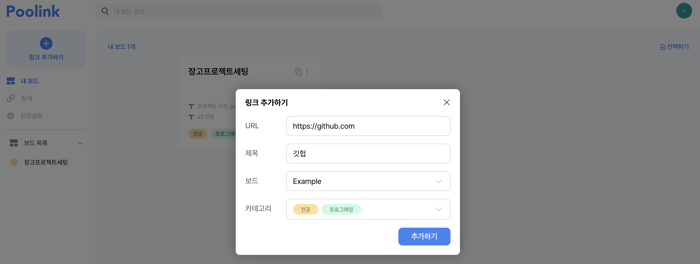
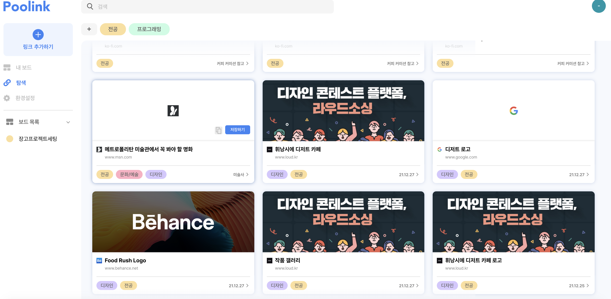

# Poolink API Server

풀링 어플리케이션의 백엔드 api 서버입니다. Django Framework 을 사용합니다.

## 🎬 How To Start
로컬 환경에 개발환경을 세팅하는 방법을 설명합니다.

###  [ Requirements ]

- [**Docker**](https://www.docker.com/)

    **Docker** 를 사용하여 간편하고 통일된 개발환경 세팅을 지향합니다.

- **Python 3.8** , [**Pipenv**](https://pipenv.pypa.io/en/latest/)

    pipenv 로 효율적으로 패키지 관리를 합니다.

- Vscode and Devcontainer ( Recommended )

### [ Running on devcontainer ]

1. VS Code extension Remote - Containers (by Microsoft) 설치.

1. Clone 한 레포지토리 디렉토리를 열고  at command palette (<kbd>ctrl</kbd> + <kbd>shift</kbd> + <kbd>P</kbd> or <kbd>cmd</kbd> + <kbd>shift</kbd> + <kbd>P</kbd>)에서 **Remote-Containers: Reopen in Container...** 선택.

1. 끝!
---------

## 🚀 Deployment

 [AWS Elastic Beanstalk](https://docs.aws.amazon.com/elasticbeanstalk/latest/dg/Welcome.html) 과 **GitHub Actions** 을 사용하여 배포합니다
 (추후 Doker 배포로 변경 예정).

-----------

## 🏊‍♂️ Introducing Poolink
> 풀링은 학습, 레퍼런스, 위시리스트 등 다양한 이유로 여기저기 저장되고 있는 링크들의 효율적인 관리를 위한 웹어플리케이션 입니다. 링크를 보드에 저장하고 카테고리로 분류하여 체계적이고 손쉽게 저장 및 관리할 수 있습니다.
> 다른 사람이 저장한 링크들이 궁금하다면 탐색 페이지에서 지정한 카테고리에 해당하는 링크들을 보여줍니다. 관심있는 링크들을 내 보드에 추가할 수 있습니다.

   

### ❕ Requirements
 풀링은 구글 oauth 를 사용합니다. 풀링 사용을 위해선 구글 계정이 필요합니다.

 ### ✨How To Use
 [ 저장 페이지 ]
 
 1. 저장하고 싶은 링크를 복사
 2. 풀링 사이트에서 **링크추가하기** 클릭, 링크 붙여넣기
 3. 해당 링크의 카테고리, 링크가 저장될 보드 지정

  
 [ 탐색 페이지 ]

 
 1. 선호 카테고리 선택
 2. 마음에 드는 링크가 있다면 저장
 3. 해당 링크와 같은 보드에 저장된 다르 링크들이 보고싶다면 하단에 표시된 보드 이름 클릭!
 4. 보드가 마음에 든다면 스크랩
